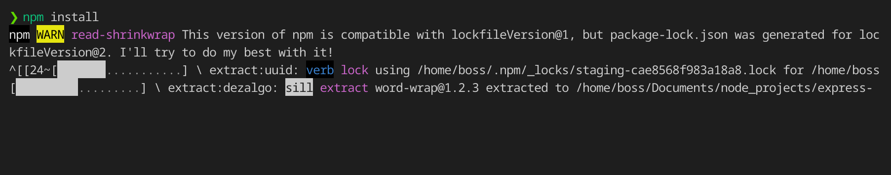
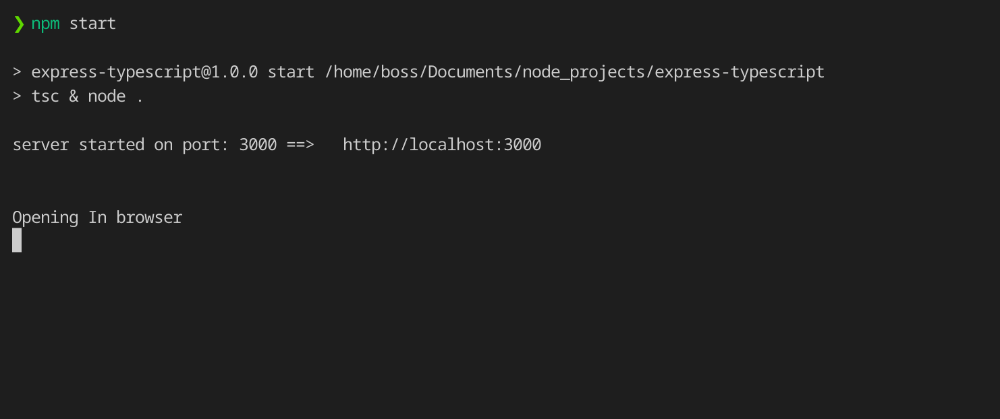
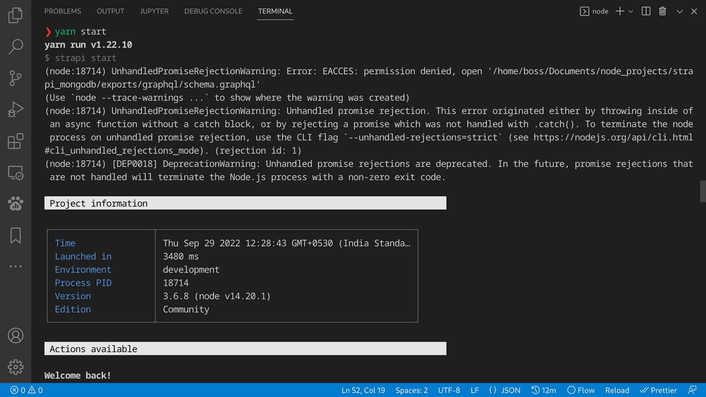
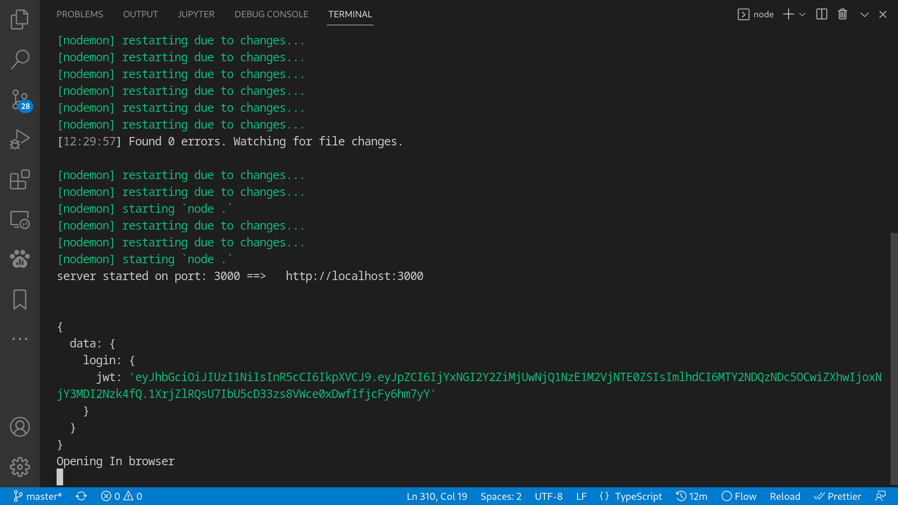
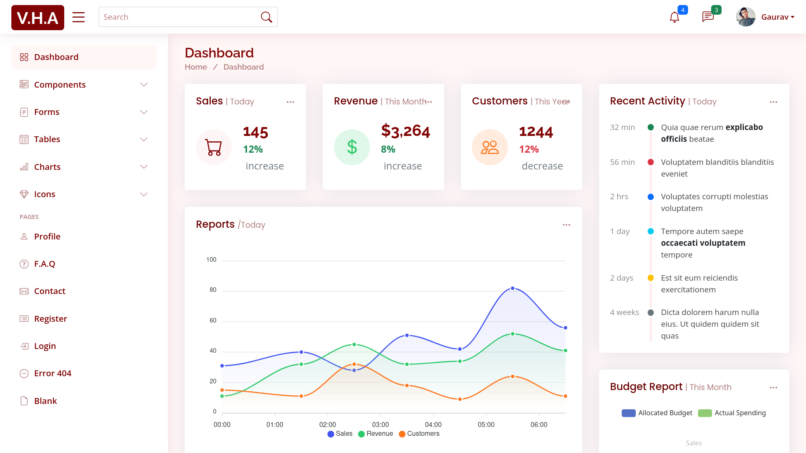
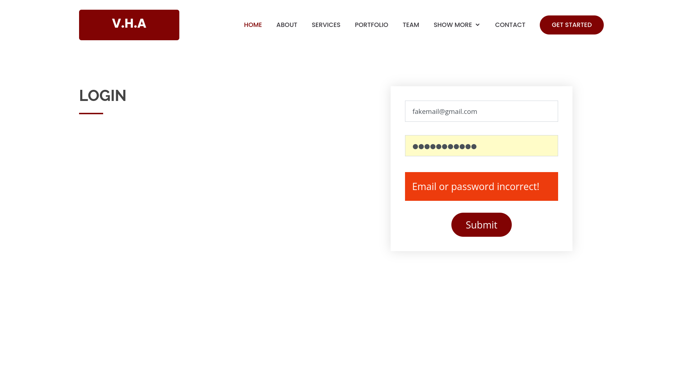
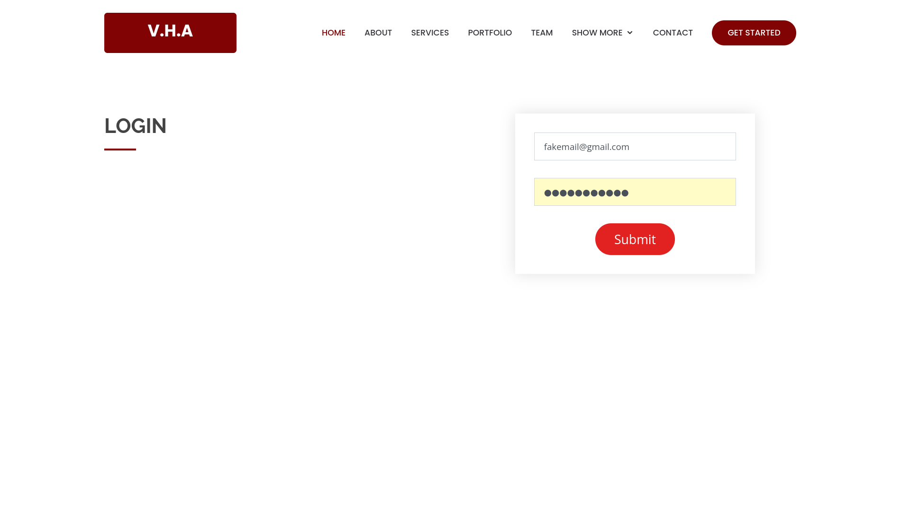
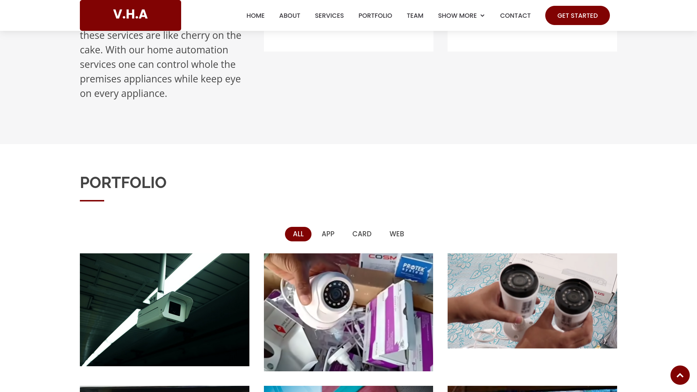

  

<!-- PROJECT LOGO -->
<br />
<div align="center">
  <a href="https://github.com/home-automation-website">
    
  </a>
  
  <h3 align="center"><b>Home Automation Website</b></h3>

  <p align="center">
    A UI design for home automation projects.
    <br />
    <a href="#"><strong>Explore the docs »</strong></a>
    <br />
    <br />
    <a href="https://github.com/othneildrew/Best-README-Template">View Demo</a>
    ·
    <a href="https://github.com/gv211432/home-automation-website/issues">Report Bug</a>
    ·
    <a href="https://github.com/gv211432/home-automation-website/issues">Request Feature</a>
  </p>
</div>

<!-- ABOUT THE PROJECT -->

## ☑️ About The Project

**Vishwakarma Home Automation**<br>
This project is a website namely `Bethany` form [BootstrapMade](https://bootstrapmade.com/bethany-free-onepage-bootstrap-theme/) is broken down and converted into useful components.
Technology used for this is ExpressJs, NodeJs, EJS (Embedded JavaScript Templates).

This project is developed by [me](https://github.com/gv211432)


“Home automation” refers to the automatic and electronic control of household features, activity, and appliances. In simple terms, it means you can easily control the utilities and features of your home via the Internet to make life more convenient and secure, and even spend less on household bills. Read on to find answers to some of the most common questions about home automation technology, and get a few ideas for home automation solutions to incorporate in your home.

Home automation is a network of hardware, communication, and electronic interfaces that work to integrate everyday devices with one another via the Internet. Each device has sensors and is connected through WiFi, so you can manage them from your smartphone or tablet whether you’re at home, or miles away. This allows you to turn on the lights, lock the front door, or even turn down the heat, no matter where you are.

## 🧩 Requirements

Database dependency project.
This project is dependent on [this](https://github.com/gv211432/HomeAutomationSchema) project.

This project uses [Strapi](https://strapi.io/) a headless content management system as a database management and [MongoDB](https://www.mongodb.com/) a database. GraphQL is used for interfacing these systems with the website.

<br>

## ⚙️ Installation

Just clone this project:

```js
git clone https://github.com/gv211432/home-automation-website.git
```

Then go to `home-automation-website` folder

and run command `yarn install` or `npm install`
then run command `yarn dev` or `npm dev`

### 1. `npm install` :



### 2. `npm start` :



<br>

## 📷 Extra Snaps

<br>













<p align="right">(<a href="#top">back to top</a>)</p>

## 📖 License

[MIT](https://github.com/gv211432/home-automation-website/blob/main/LICENSE)
