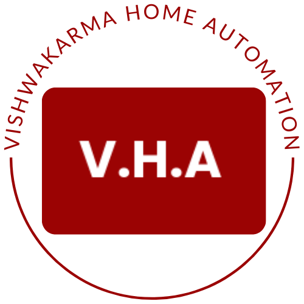
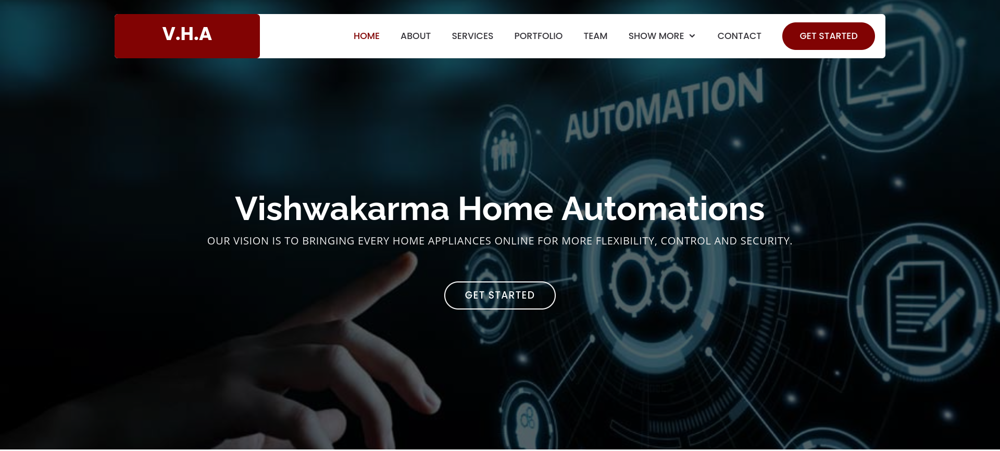

  

<!-- PROJECT LOGO -->
<br />
<div align="center">
  <a href="https://github.com/othneildrew/Best-README-Template">
    
  </a>
  
  <h3 align="center"><b>Website Home automation</b></h3>

  <p align="center">
    Print array, array of array, vector, vector of vector <br> and strings more beautifully 👰
    <br />
    <a href="#"><strong>Explore the docs »</strong></a>
    <br />
    <br />
    <a href="https://github.com/othneildrew/Best-README-Template">View Demo</a>
    ·
    <a href="https://github.com/gv211432/express-typescript/issues">Report Bug</a>
    ·
    <a href="https://github.com/gv211432/express-typescript/issues">Request Feature</a>
  </p>
</div>

<!-- ABOUT THE PROJECT -->

## ☑️ About The Project

**Print more beautifully.**<br>
This project is a website namely `Bethany` form [BootstrapMade](https://bootstrapmade.com/bethany-free-onepage-bootstrap-theme/) is brocken down and converted into useful components.
Technology used for this is ExpressJs, NodeJs, EJS (Embedded JavaScript Templates).

This project is developed by [me](https://github.com/gv211432)



## ⚙️ Installation 

Just clone this project: 

``` js
git clone https://github.com/gv211432/express-typescript.git 
```

Then go to `express-typescript` folder 

And run command `yarn dev` or `npm dev` 

## 🧩 Requirements

This project uses [Strapi](https://strapi.io/) a headless content management system as a database management and [MongoDB](https://www.mongodb.com/) a database. GraphQL is used for interfacing these systems with the website. 